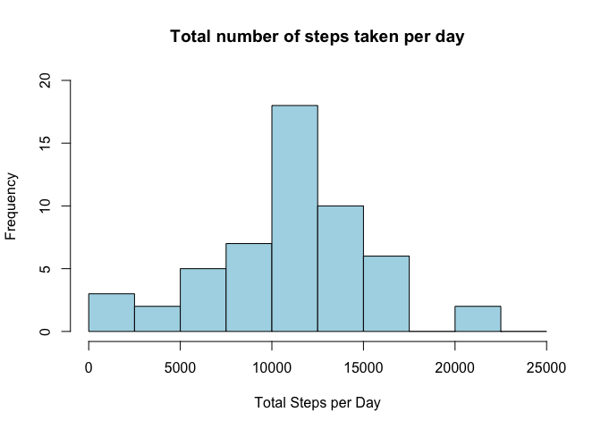
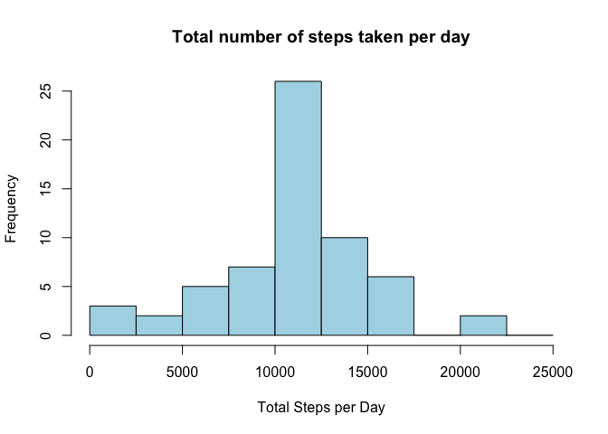
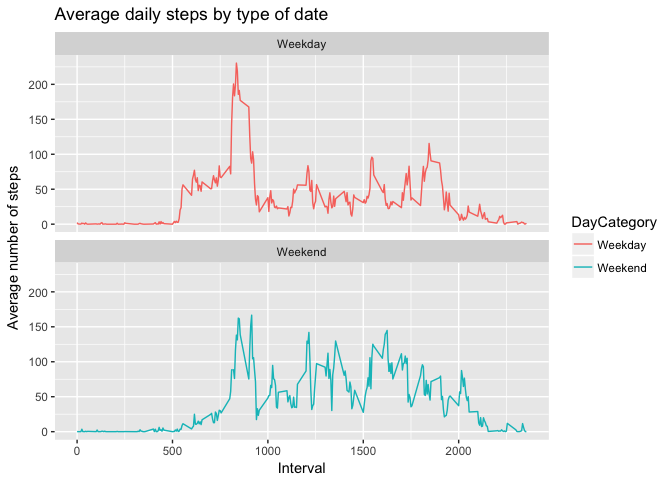

Background
----------

It is now possible to collect a large amount of data about personal
movement using activity monitoring devices such as a Fitbit, Nike
Fuelband, or Jawbone Up. These type of devices are part of the
“quantified self” movement – a group of enthusiasts who take
measurements about themselves regularly to improve their health, to find
patterns in their behavior, or because they are tech geeks. But these
data remain under-utilized both because the raw data are hard to obtain
and there is a lack of statistical methods and software for processing
and interpreting the data.

This assignment makes use of data from a personal activity monitoring
device. This device collects data at 5 minute intervals through out the
day. The data consists of two months of data from an anonymous
individual collected during the months of October and November, 2012 and
include the number of steps taken in 5 minute intervals each day.

Data Loading and Preparation
----------------------------

First, data is downloaded from the Forked repository as a zip file:

    setwd("~/Desktop/Coursera All/Rep Data")
    mydata <- read.csv(unz("activity.zip", "activity.csv"))
    dim(mydata)

    ## [1] 17568     3

    head(mydata)

    ##   steps       date interval
    ## 1    NA 2012-10-01        0
    ## 2    NA 2012-10-01        5
    ## 3    NA 2012-10-01       10
    ## 4    NA 2012-10-01       15
    ## 5    NA 2012-10-01       20
    ## 6    NA 2012-10-01       25

    summary(mydata)

    ##      steps                date          interval     
    ##  Min.   :  0.00   2012-10-01:  288   Min.   :   0.0  
    ##  1st Qu.:  0.00   2012-10-02:  288   1st Qu.: 588.8  
    ##  Median :  0.00   2012-10-03:  288   Median :1177.5  
    ##  Mean   : 37.38   2012-10-04:  288   Mean   :1177.5  
    ##  3rd Qu.: 12.00   2012-10-05:  288   3rd Qu.:1766.2  
    ##  Max.   :806.00   2012-10-06:  288   Max.   :2355.0  
    ##  NA's   :2304     (Other)   :15840

From the result above, we can see there are 17568 records and 3
variables in the data. For the variable **steps**, there are 2304
records have NA values. In the data processing step, we will add a new
variable indicating the weekdays, and create a cleaned dataset without
NAs:

    mydata$day <- mydata$day <- weekdays(as.Date(mydata$date))
    mydata_clean <- mydata[!is.na(mydata$steps),]

What is mean total number of steps taken per day?
-------------------------------------------------

1.  Calculate the total number of steps taken per day

<!-- -->

    steps_day <- aggregate(steps ~ date, data=mydata_clean, FUN=sum)
    head(steps_day)

    ##         date steps
    ## 1 2012-10-02   126
    ## 2 2012-10-03 11352
    ## 3 2012-10-04 12116
    ## 4 2012-10-05 13294
    ## 5 2012-10-06 15420
    ## 6 2012-10-07 11015

1.  Make a histogram of the total number of steps taken each day

<!-- -->

    hist(steps_day$steps, xlab="Total Steps per Day", ylab="Frequency", main = "Total number of steps taken per day",breaks=seq(0,25000,by=2500),ylim=c(0,20),col="lightblue")

3.Calculate and report the mean and median of the total number of steps
taken per day

    #Mean
    mean(steps_day$steps)

    ## [1] 10766.19

    #Median
    median(steps_day$steps)

    ## [1] 10765

What is the average daily activity pattern?
-------------------------------------------

1.  Make a time series plot of the 5-minute interval (x-axis) and the
    average number of steps taken, averaged across all days (y-axis)

<!-- -->

    steps_interval <- aggregate(steps ~ interval, data = mydata_clean, FUN = mean) 
    plot(steps_interval, type = "l")

 2.
Which 5-minute interval, on average across all the days in the dataset,
contains the maximum number of steps?

    #maximum steps
    maxsteps <- max(steps_interval$steps)
    #the interval contains the maximum average number of steps
    steps_interval[steps_interval$steps==maxsteps,1]

    ## [1] 835

Imputing missing values
-----------------------

1.  Calculate and report the total number of missing values in the
    dataset

<!-- -->

    sum(is.na(mydata))

    ## [1] 2304

2.Devise a strategy for filling in all of the missing values in the
dataset. The strategy does not need to be sophisticated

My strategy for filling in NAs will be to substitute the missing steps
with the mean steps of the respective 5-minute interval

    imputed_steps <- steps_interval$steps[match(mydata$interval, steps_interval$interval)]

1.  Create a new dataset that is equal to the original dataset but with
    the missing data filled in.

<!-- -->

    mydata_imputed <- transform(mydata, steps = ifelse(is.na(mydata$steps), yes = imputed_steps, no = mydata$steps))

1.  Make a histogram of the total number of steps taken each day and
    Calculate and report the mean and median total number of steps taken
    per day. Do these values differ from the estimates from the first
    part of the assignment? What is the impact of imputing missing data
    on the estimates of the total daily number of steps?

<!-- -->

    steps_day_impute <- aggregate(steps ~ date, data=mydata_imputed, FUN=sum)
    hist(steps_day_impute$steps, xlab="Total Steps per Day", ylab="Frequency", main = "Total number of steps taken per day",breaks=seq(0,25000,by=2500),col="lightblue")

    #Mean
    mean(steps_day_impute$steps)

    ## [1] 10766.19

    #Median
    median(steps_day_impute$steps)

    ## [1] 10766.19

Are there differences in activity patterns between weekdays and weekends?
-------------------------------------------------------------------------

1.Create a new factor variable in the dataset with two levels –
“weekday” and “weekend” indicating whether a given date is a weekday or
weekend day

    ## create new category based on the days of the week
    mydata_imputed$DayCategory <- ifelse(mydata_imputed$day %in% c("Saturday", "Sunday"), "Weekend", "Weekday")

2.Make a panel plot containing a time series plot (i.e. 𝚝𝚢𝚙𝚎 = “𝚕”) of
the 5-minute interval (x-axis) and the average number of steps taken,
averaged across all weekday days or weekend days (y-axis). See the
README file in the GitHub repository to see an example of what this plot
should look like using simulated data.

    library(ggplot2)
    steps_daycat <- aggregate(steps ~ interval + DayCategory, mydata_imputed, FUN=mean)
    plot <- ggplot(steps_daycat, aes(x = interval , y = steps, color = DayCategory)) +
           geom_line() +
           labs(title = "Average daily steps by type of date", x = "Interval", y = "Average number of steps") +
           facet_wrap(~DayCategory, ncol = 1, nrow=2)
    plot

